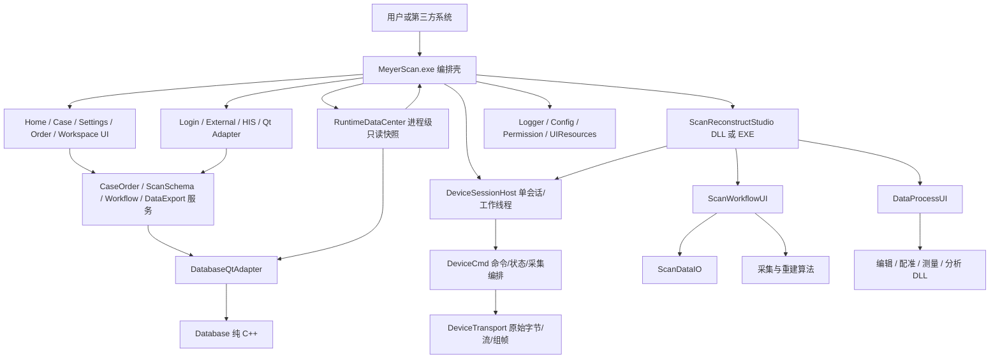

# MeyerScan 架构设计与接口规范

> **文档职责**：规定模块依赖、运行时边界、数据合同、接口稳定性、资源生命周期和集成规则。
>
> 完整模块中文名、项目名、产物和功能说明只在 `MeyerScan重构任务总览.md` 维护，本文不再复制同一张大表。
>
> **唯一维护位置**：`F:\MeyerScan\Documents`。公共头文件和可编译代码是接口实现的最终事实来源。
>
> 设备协议版本、机型使用指南、完整命令示例、命令适用范围和实机验证记录维护在 `F:\MeyerScan\Documents\设备相关`，本文只保留架构边界和接口合同。

## 1. 架构目标

1. 人工可读优先：一个模块只处理一类问题，代码量和依赖保持可理解。
2. 边界优先：是否使用 Qt 不是第一判断，UI、业务、数据、设备和算法不能越层。
3. 轻量化：只在独立变化、独立资源、独立依赖或独立交付确实存在时拆模块。
4. 可替换：MainExe 不静态绑定大量业务 DLL；外部/长期接口使用稳定 ABI。
5. 可验证：每个模块可独立构建、测试、记录版本和排查日志。
6. 可恢复：配置、数据库、插件、进程和升级失败都有明确失败合同，不留下半更新状态。

## 2. 分层架构



### 2.1 分层与模块归属

| 层 | 当前模块 | 允许职责 |
|---|---|---|
| 主宿主/编排 | `MyMainExe` | 启动、单实例、登录、模块生命周期、页面挂载、轻量流程和进程调度 |
| UI 容器 | `MyOrderScanWorkspaceShell`、`MyScanReconstructStudio` | 页面容器、步骤导航、激活/释放，不实现步骤业务 |
| 业务 UI | Home、Case、Settings、OrderCreate、ScanWorkflow、DataProcess、Send、两校准 UI | 展示、输入、局部交互、动作上报 |
| 业务服务 | 已落地 CaseOrder、ScanSchema；规划中的 OrderWorkflow、DataExport、Statistics | 业务校验、事务、状态、结构化查询和动作结果 |
| 运行时读模型 | RuntimeDataCenter | 常用数据和云端信息的只读快照 |
| 适配层 | DatabaseQtAdapter、ExternalLaunchAdapter；规划中的 Login/HIS Adapter | 类型、协议和来源差异转换 |
| 基础设施 | Logger、Database、ConfigCenter、Permission、UIResources | 通用能力，不理解页面流程 |
| 设备与算法 | 已落地 DeviceTransport、DeviceCmd；规划中的 ScanDataIO、PreProcess 和处理工具 DLL | 硬件通信、设备语义、数据 IO、算法和纯数据处理 |
| 独立进程 | ScanReconstructStudio.exe、MyUpdate.exe、安装器 | 隔离高资源/更新/交付边界 |

### 2.2 依赖方向

- 依赖只能从上层指向下层；Database、Logger 等基础设施不能反向依赖 UI 或业务服务。
- UI 不能直接访问 Database、SQL、配置文件或权限规则文件。
- RuntimeDataCenter 只为读取优化，写操作必须走 Service。
- Adapter 只转换数据/协议，不拥有业务状态和页面。
- MainExe 可以编排服务和 UI，但不能成为业务规则仓库。
- Scan/Process UI 不持有设备协议和重算法实现，只调用对应接口。
- 两个模块互相调用并不等于应合并；是否合并取决于职责、变化原因、依赖和资源生命周期。

## 3. 模块拆分判定

满足以下任一条件时可考虑拆分：

- 需要独立替换、定制、版本或发布。
- 有独立且较重的第三方依赖，例如 VTK、设备 SDK 或算法库。
- 有独立资源生命周期，例如显存、大模型、线程或进程。
- 与调用者的变化原因不同，且接口可以稳定。
- 至少两个调用方需要复用同一能力。
- 单模块已经难以人工阅读、测试或定位问题。

以下情况不拆：

- 只有几行转发代码，没有独立规则或依赖。
- 只是为了减少单文件行数，却增加跨 DLL 调试和版本成本。
- 接口尚不稳定，拆分后会频繁同步修改所有调用方。
- 只能以万能 Common/Manager/Helper 命名，职责无法一句话说明。

拆分后仍需检查：调用链是否更清楚、测试是否更简单、依赖是否单向、失败是否能独立定位。若答案是否定，应留在原模块或使用私有类/源文件分层。

## 4. 动态加载与生命周期

### 4.1 MainExe 插件加载

自研功能 DLL 默认使用：

1. 根据 `applicationDirPath()` 组成绝对路径。
2. `QLibrary`/Win32 加载 DLL。
3. 解析 `GetMeyerModuleApiVersion()` 并校验公共接口 ABI；缺失或不匹配立即拒绝。
4. 解析稳定的 `extern "C"` 工厂函数；`GetMeyerModuleVersion()` 只用于代码版本清单，不代替 ABI 门禁。
5. 记录加载路径、版本、成功/失败和降级结果。
6. 宿主持有 DLL 句柄，插件对象销毁后才能卸载 DLL。

MainExe 不链接这些插件的 import lib，只包含公共接口头。确实需要静态链接的低层库必须说明原因，不把“动态加载”机械套到所有代码。

### 4.2 标准生命周期

推荐顺序：

`Load -> ResolveFactory -> GetInterface -> Init -> SetContext -> CreateWidget -> Activate -> DeactivateAndRelease -> Shutdown -> DestroyInterface -> Unload`

- `Init`、`SetContext`、`CreateWidget` 都必须返回可判断的结果。
- `CreateWidget` 只创建页面，不隐式启动相机、线程或重算法。
- 页面真正挂载并可见后由宿主调用 `Activate()`。
- 重页面离开时调用 `DeactivateAndRelease()`，先停事件/线程，再释放 VTK/OpenGL/模型，最后销毁 QWidget。
- Qt `deleteLater()` 依赖事件循环；需要立即释放重资源时必须提供显式释放接口，不能只等延迟析构。
- 插件对象、回调和 QWidget 全部销毁后才能卸载 DLL，避免函数指针或虚表指向已卸载代码。

### 4.3 页面所有权

- MainExe 只维护一个全屏内容区；Home 与 Case 不是长期并列的 `QStackedWidget` 缓存页。
- Home、Case 和 WorkspaceShell 各自拥有符合页面语义的顶部区域，MainExe 只执行窗口动作。
- WorkspaceShell 是 Order/Scan/Process/Send 步骤条的唯一所有者，子页面不得重复绘制步骤导航。
- SettingsUI 是临时覆盖/对话流程，必须携带 `sourcePage`；关闭后由 MainExe 决定刷新谁。
- CaseUI 进入扫描前必须析构，不能只隐藏。

## 5. 跨模块接口合同

### 5.1 边界类型选择

| 场景 | 推荐类型 | 禁止内容 |
|---|---|---|
| 同进程、同 Qt/编译器、受控 MeyerScan 模块 | QString、QByteArray、QJson 可作为便捷重载；底层仍建议稳定接口 | QObject/QWidget 所有权不清、跨 DLL 释放对方分配的对象 |
| 自研插件公共 C ABI | `const char*` UTF-8、POD、枚举、调用方缓冲区、稳定接口指针 | 暴露 STL 容器、异常、模板 ABI、由另一侧 delete 的内存 |
| 跨进程 IPC | 版本化 JSON/二进制消息、文件路径、订单 ID、数据句柄 | QString 指针、QObject、VTK 对象、大块模型内存所有权 |
| 第三方 SDK/API | 明确长度的 UTF-8、POD、错误码、调用方缓冲区 | 内部类、私有数据库结构和无版本消息 |

Qt 模块调用 C ABI 时，临时 UTF-8 数据必须先保存为命名 `QByteArray`，再传 `constData()`；不能让被调用方保存该临时指针。需要长期保存时由接收方复制。

### 5.2 缓冲区接口

可变长输出统一采用两次调用或明确容量：

1. 调用方传空缓冲区查询所需字节数。
2. 调用方分配缓冲区并再次调用。
3. 返回值区分成功、容量不足、无数据和业务错误。
4. 输出 UTF-8 必须包含终止符规则，并写在公共头注释中。

禁止返回指向函数局部 `std::string`、临时 `QByteArray` 或临时 JSON 的指针。模块内部需要返回稳定 `const char*` 时，使用明确生命周期的成员缓存，并标注下一次调用是否覆盖。

### 5.3 回调

- C 回调包含 `userData`，由调用方恢复上下文。
- 动作使用稳定英文 ID，例如 `home.create`、`workspace.step.scan`，显示文案由 UI 翻译。
- 注册和注销时机明确；宿主销毁前先清空插件回调。
- Qt 信号连接中的 lambda 捕获对象必须有 QObject context 或显式断开，防止页面销毁后继续回调。

### 5.4 错误合同

- 公共接口不得只靠日志表示失败，必须返回 bool/错误码/Result。
- 错误至少区分：参数错误、未初始化、依赖缺失、版本不兼容、解析失败、权限拒绝、数据库失败、资源不足和内部错误。
- 调用方必须检查返回值，决定重试、降级、回退页面或终止流程。
- DLL 边界不抛出 C++ 异常；内部捕获后转换为错误码并记录日志。
- 可选依赖失败时清空旧接口指针和能力状态，不能继续使用上一次成功结果。

## 6. 版本化 JSON 合同

### 6.1 通用结构

易变化数据使用 UTF-8 JSON，最少包含：

```json
{
  "schemaVersion": 1,
  "source": {},
  "data": {},
  "extensions": {}
}
```

- `schemaVersion`：决定解析和迁移策略。
- 稳定字段：常用且有明确业务含义的 key。
- `extensions`：客户/第三方新增字段，避免每次扩展公共 ABI。
- 未识别字段默认保留或忽略，不能导致旧版本崩溃。
- 修改合同必须同时更新生产者、消费者、示例、测试和文档。

### 6.2 标准建单上下文

顶层固定为：

- `source`：入口类型、`thirdPartyType`、来源名称/系统/版本、外部 ID。
- `patient`：患者稳定字段和扩展字段。
- `order`：订单稳定字段、医生/诊所/技工所引用和状态。
- `scanPlan`：治疗类型、FDI 牙位、桥、咬合和材料等。
- `scanProcess`：扫描步骤 `steps` 及生成配置。

OrderCreateUI 接收标准上下文，不理解第三方私有字段。External/HIS Adapter 负责归一化；ScanSchemaService 负责生成扫描步骤，CaseOrderService 负责患者/订单持久化，Workflow 决定后续步骤。

### 6.3 事务式更新

收到新 JSON 时：

1. 解析到候选对象。
2. 验证 schema、类型、必填字段、范围和引用关系。
3. 完整成功后一次性替换当前状态。
4. 任一步失败则保留上一份有效状态并返回错误。

该规则适用于建单上下文、权限、配置、IPC 状态和云端快照。

## 7. 数据架构

### 7.1 标准访问链路

```text
MyCaseUI / MySettingsUI
        <- MainExe 注入版本化只读 domain 快照
        <- RuntimeDataCenter 旧库/高频只读快照（MainExe 统一读取）
        <- CaseOrderService 患者/订单轻量读模型（MainExe 按稳定 ID 合并）

MyOrderCreateUI / 其它业务 UI 动作
        -> MainExe / Workflow 编排
        -> CaseOrderService / ScanSchemaService
        -> MyDatabaseQtAdapter（需要持久化时）
        -> MyDatabase（连接、SQL、事务）
```

- Database 不知道业务表语义。
- DatabaseQtAdapter 不知道字段含义。
- Service 负责 SQL/schema、业务校验、事务、状态和审计。
- RuntimeDataCenter 缓存高频只读数据，不接收 SQL 或表名；迁移期继续提供未迁移旧表记录。
- CaseOrderService 拥有新患者/订单 schema，并通过白名单 queryName 输出轻量列表；MainExe 合并后再注入 UI。
- UI 只消费 DTO/JSON 和提交动作。

### 7.2 数据归属

| 数据 | 所有者 | 读取方式 |
|---|---|---|
| 患者、订单 | CaseOrderService | 新表列表走 Service；MainExe 与 RuntimeDataCenter 旧表快照按稳定 ID 合并；搜索/详情/写入走 Service |
| 诊所、医生、技工所 | CaseOrderService 参考数据 | RuntimeDataCenter 快照或 Service 查询 |
| 软件设置、账号、设备 | 对应服务；骨架期由 RuntimeDataCenter 读入 | UI 不直接读表 |
| 扫描方案 | ScanSchemaService | OrderCreate/Workflow/Scan 读取标准合同 |
| 云端诊所信息 | 登录/云同步模块写入 RuntimeDataCenter | 其他模块读取只读云端快照 |

患者和订单字段变化频繁，因此不创建固定字段 CaseEntity.lib。服务合同通过 `schemaVersion + stable keys + extensions + 数据库迁移` 演进。

### 7.3 数据库切换

- 当前默认 SQLite；Database 保留 MySQL 类型和配置边界。
- 数据库类型由 ConfigCenter/部署配置决定，UI 不直接切换底层连接。
- 切换前必须关闭查询/事务、清理连接、验证目标配置并记录结果。
- schema 变更通过版本化迁移执行，不能依赖用户手工运行旧 `mysql.sql`。

## 8. 配置与权限

### 8.1 两类 JSON

| 文件 | 作用 | 示例 |
|---|---|---|
| `runtime_config.json` | 产品行为、客户默认值和可调参数 | 数据库类型、路径、主题、语言、功能默认策略 |
| `permission_rules.json` | 当前授权结果和功能规则 | `featureId`、`visible`、`enabled`、约束条件 |

配置回答“产品怎么运行”，权限回答“当前用户/客户/设备能否使用”。同一功能可以配置为默认开启，但权限最终拒绝。

设备生产模式工作台策略属于 ConfigCenter：`device.practiceAllowProductionMode` 默认 true，`device.orderCreateAllowProductionMode` 默认 false。两项只控制练习/创建工作台，不控制颜色或三维校准。

`singleInstance` 和启动等待页属于固定流程，不放入 runtime config。JSON 不写注释；字段说明放同目录 Markdown。

### 8.2 visible 与 enabled

- `visible=false`：入口不创建或隐藏，用户不可见。
- `visible=true, enabled=false`：入口显示但不可操作，可用于提示未授权/条件不满足。
- `visible=true, enabled=true`：UI 可发起动作，但高价值动作仍需后端复核。

UI 的按钮权限集中在 `ApplyPermissions()` 或少量按时机拆分的函数中，禁止散落到每个点击槽。

### 8.3 六维权限

当前目标维度：角色/账号、客户/诊所、设备型号与编号、软件版本/产品包、时间有效期、配置/授权方案。流程为：

1. 登录、许可和设备信息形成权限输入快照。
2. Permission 加载规则并生成不可变权限快照。
3. MainExe 把页面所需权限上下文注入 UI。
4. UI 应用 visible/enabled，改善体验。
5. MainExe 在导航和插件加载前复核。
6. Service/Workflow 在保存、删除、扫描、导出、校准、升级等动作前复核。
7. 独立进程/IPC 对高价值命令再次复核，不信任 UI 传来的“已授权”。
8. 拒绝和命中规则写日志，但不泄露敏感规则全文。

定制客户和功能阉割不能只删除按钮或只改 JSON；至少需要 UI + 编排/服务两层生效，关键功能需要 IPC/进程层第三次校验。

## 9. UI 架构

### 9.1 分辨率与布局

- 以 1920x1080 作为设计基准可以保留，但不能对所有控件坐标和尺寸整体乘系数。
- 页面必须使用 Qt Layout、伸缩因子、sizePolicy、最小/最大宽高、滚动区和内容优先级。
- DPI 工具只提供离散图标、间距、边距和触控区域尺寸。
- 固定格式区域使用稳定约束，动态文字不能推动工具栏、牙弓、步骤条或 VTK 视区跳动。
- 验证分辨率至少为 1366x768、1920x1080、2560x1440；高 DPI 图片按资源档位选择。

### 9.2 多语言

- 所有可见字符串写 `tr("English source text")`。
- 模块维护自己的业务 qm；业务模块先执行 `tr("English source text")`，再把翻译结果传给 UIComponents 公共控件/弹窗。UIComponents 不翻译业务错误原因。
- 禁止按语言写位置/大小 if/else；通过布局、换行、省略号、tooltip 和合理最小宽度吸收文本增长。
- 切换语言时由统一 LanguageManager 规划通知，模块响应 `LanguageChange` 更新文本。

### 9.3 样式和资源

- 业务源码禁止直接 `setStyleSheet()`；统一 QSS 加载入口是唯一例外。
- QSS 使用 `role`、`layout`、`state` 等动态属性表达按钮类型，不为每个页面复制样式。
- 各模块资源源码位于 `Resources/icon`、`Resources/qss`、`Resources/qm`。
- 构建时由 MyUIResources 聚合并嵌入 `MeyerScan_UIResources.dll`。
- 运行时先注册资源 DLL，再加载 QSS/图片；资源加载失败记录路径、资源 ID 和降级结果。
- 当前保持一个 UIResources DLL，不拆 Icon.dll/Qss.dll，避免重复加载和非原子升级。
- `MeyerUiResourceContract.h` 是资源 API、RCDATA 编号、清单 schema 和 qrc 前缀的唯一来源；加载器在初始化前动态解析合同查询函数并逐项校验。
- Windows 文件详细信息必须记录 `ResourceApiVersion`、`ResourcePayloadId`、`ResourceManifestSchema`、`ResourcePrefix`、`ResourceManifest` 和 `ResourceExports`，用于现场人工核对；运行时仍以导出查询接口为准，不能只信任描述字符串。
- 资源仅变化时允许独立发布资源 DLL，不强制重编译业务 DLL；前提是旧资源 alias 无删除/改名、加载 ABI 与 Qt 环境兼容，并经过目标客户原版本回归。业务 DLL 版本不因纯资源补丁伪递增。

### 9.4 共享和专用控件

进入 UIComponents：通用按钮角色、标签、输入、下拉、日期、开关、表格基础行为、等待页；单按钮信息/成功/错误弹窗和双按钮警告/高危弹窗通过独立 C ABI 导出，避免修改既有虚函数表。Toast 尚未实现。

留在业务模块：牙位 mask 交互、扫描工具、VTK 视区、治疗类型资源合成、只在一个模块使用的复杂业务控件。

公共虚接口扩展只允许在末尾追加函数，或通过接口版本新增 V2；禁止在中间插入函数改变虚表布局。

## 10. 扫描重建架构

### 10.1 双形态

- `MeyerScan_ScanReconstructStudio.dll`：嵌入 MeyerScan 创建/练习流程，进程内传标准上下文。
- `ScanReconstructStudio.exe`：独立练习/定制/SDK 场景，使用版本化 IPC。
- 两种产物共用同一窗口和阶段编排代码，禁止复制两套 Scan/Process 实现。

### 10.2 阶段职责

- ScanWorkflowUI：流程选择、扫描控制、提示、数据显示、设备/算法动作上报。
- DataProcessUI：处理工具入口、提示、数据显示、处理动作上报；不出现扫描 Start/Pause。
- ScanReconstructStudio：装载、切换、上下文转发和重资源释放。
- 设备、采集、重建、编辑、分析分别由下层能力接口实现。

### 10.3 数据与 IPC

- 控制消息传订单 ID、步骤 ID、状态、进度、错误和数据文件/共享内存句柄。
- 不通过 JSON 传大块网格、图像或 VTK 对象。
- IPC 消息含 `schemaVersion`、`requestId`、`command`、`payload` 和结果/错误。
- 当前看门狗只关注 MeyerScan 与扫描进程的信息传输和状态同步，不把超时自动重启作为重点。
- 独立 EXE 异常退出后 MainExe 记录订单、步骤、退出码和最近 IPC 状态，并提供用户可理解的恢复入口。

### 10.4 显示交互

- 流程按钮代表扫描部位，必须有手型光标、tooltip、选中态，并切换对应数据。

### 10.5 设备通信边界

- `MyDeviceTransport / MeyerScan_DeviceTransport.dll` 当前只实现 Windows x64 CyAPI USB；公共接口使用 `MeyerDeviceTransport_*` C ABI。它负责连接、重连、原始命令字节、原始流、异步队列、包同步和完整帧交付，不解释“曝光/开灯/固件”等业务语义。
- `MyDeviceCmd / MeyerScan_DeviceCmd.dll` 是纯 C++ 设备协议语义层，负责 52 个 A 类命令码的编码、响应查找、长度/命令码校验、回包解析和固定 POD 转换，覆盖设备编号、产品身份、主控板/投图板版本、基础状态、灯光、相机/曝光/帧率、温度、两路相机标定、大小扫描头颜色矩阵/颜色标定、设备授权信息、固件擦除/分包烧写以及开始/停止采集编排；它通过显式绝对路径动态加载 DeviceTransport，不链接其 import lib。
- 公共结构必须包含 `structSize + schemaVersion + reserved`，只传固定宽度整数、固定 UTF-8 数组、原始字节和调用方缓冲区；DeviceCmd 内部可用 `std::string`/字节容器，但 C++ 异常、`std::string`、字符串数组、其它 STL 容器和 CyAPI 类型不得越过 DLL 边界。
- 设备身份分三层：`MyScan3/5/5H/6/6Wireless` 只作为协议/硬件能力 Profile；`mOS MyScan / mOS MyScan 5 / mOS MyScan 6` 是产品系列；P1/P2/P3、海外、贴牌、医院和龋齿检测版是具体产品。三者禁止复用同一枚举或同一显示名称。
- DeviceCmd 内的 `DeviceProductCatalog` 是产品映射唯一来源。完整 8 位型号代码精确映射具体产品；13 位设备编号前 8 位只确定系列候选，不能区分共享前缀的 P1/P2/P3。
- `MeyerDeviceProductIdentity` 固定 POD 同时返回产品系列、具体产品、协议 Profile、Unknown/SeriesOnly/ExactProduct/DeviceNumberUnprogrammed/Conflict 状态及连接/编号/型号代码/固件/命令能力证据位。UI 和宿主不得重建映射表。
- 普通已知 Profile 打开仍可使用 `modelHint/HostHint`；自动探测使用 `Unknown` 最小能力配置，固定执行“D4/D9 -> 生产未写号时 C2/C7 -> CD/CE”。D9 无回包/普通坏包是回包异常，合法帧中的非法编号是编号异常。命令码确认为 D9 后，payload 长度 `0xFFFF` 与求和校验失败都表示设备编号未写入并进入生产模式，两者通过独立状态字段区分。
- `MeyerDeviceDetectionRecord` 必须分别保存设备真实 `reported*` 和流程最终 `effective*` 身份值，并记录值来源、生产模式、兼容标志和 D9/C7/CE 步骤状态。旧固件兼容值不得覆盖真实字段或伪装成 `DeviceReported`。
- DeviceCmd 只负责检测和生成带来源的兼容身份，不读取“创建/练习/校准”等 UI 模式。DeviceSessionHost/工作流层负责准入；MainExe 从 ConfigCenter 分别读取创建/练习生产模式开关，默认创建禁止、练习允许。颜色校准和后续三维校准继续使用允许兼容身份策略。
- 创建工作台在进入 Scan/Process/Send 前执行严格准入，未写号时保持在 Order 且不得创建 VTK/OpenGL 扫描页；练习工作台在创建 Scan 页前执行允许兼容身份的准入。通过后把 `deviceIdentity` 写入统一工作台 JSON，同时包含 reported/effective、来源、生产/兼容标志、产品身份和检测状态。
- 生产模式中 C7 无回包形成 mOS MyScan 候选，收到 C7 形成 mOS MyScan 5/6 候选；MyScan 5/6 的区分规则待定。CE 无回包、普通坏包、坏校验、未初始化或值非法可以使用带来源的兼容值继续；C7/CE 或编号前缀/CE 冲突必须返回 Conflict。SeriesOnly 只指导后续探测，不放行依赖具体产品参数的校准。
- 已写合法编号但 CE 不可用时，兼容型号代码按已登记编号前缀选择同系列标准值（62000020/27/53/55）；未知前缀才回退 62000020。该规则是对流程图“统一默认 62000020”的安全修正，避免跨系列误用，结果仍必须标成 CompatibilityDefault。
- 同一进程只由 `DeviceSessionHost` 持有一个 DeviceCmd 句柄和一个底层连接。SettingsUI、Calibration3DUI、CalibrationColorUI、ScanWorkflowUI 不得动态加载 DeviceTransport 或自己打开 USB；MainExe 嵌入形态和 ScanReconstructStudio 独立 EXE 形态各自提供宿主实现。
- DeviceSessionHost 使用专用工作线程和串行命令队列；设置页、入口检查和校准只提交动作请求并读取不可变状态快照。宿主同时缓存最近一次完整预检 POD；状态快照必须带 `validFields`，未知/失败不能伪装成数值 0。
- 当前 MainExe 已落地 `src/device/DeviceSessionHost`：DeviceCmd/Transport 从应用目录绝对路径动态加载，USB 预检在工作线程执行，GUI 线程通过局部事件循环保持绘制响应并禁用当前按钮防止重入。
- 颜色校准入口固定执行“工作台门禁 -> Cypress 自动枚举 -> 连接 -> USB3 -> D4/D9 -> 必要时 C2/C7 -> CD/CE -> 产品身份 -> 14/15 主控板版本 -> mOS MyScan 的 12/13 投图板版本 -> 完整快照注入 -> 一次设备信息提示 -> 创建弹窗”。颜色校准不要求正式设备编号，生产设备可使用 effective 兼容身份；提示同时展示 effective 编号、具体产品、effective 型号代码、下位机版本、生产模式和兼容来源，reported 值写入 POD/日志。连接/USB/型号/必需版本失败或证据冲突不得创建/闪现弹窗，关闭动作必须关闭会话。三维校准后续采用相同身份准入规则。
- 在上述身份和版本步骤之后，`mOS MyScan 5/5H/6` 先执行主控板颜色校准版本门禁：`1.1.x`、`1.2.x` 或无法解析的版本禁止进入颜色校准；满足要求后按 A3/A4 读取大扫描头、按 B9/BA 读取小扫描头。期望响应码正确但求和失败表示对应扫描头未校准，可以继续进入并提示；超时、错误帧头、错误响应码、截断或 payload 长度异常属于读取失败，禁止进入。`mOS MyScan` 使用 `LargeOnlyShared` 策略，不发送 B9/BA，小扫描头共享大扫描头参数。结果集中记录在 `MeyerDeviceScanHeadColorCalibrationSnapshot`，MainExe/SettingsUI/CalibrationColorUI 只逐字段复制。
- 校准、扫描和工程诊断是互斥工作模式；一个所有者释放后另一个才可进入。页面关闭只释放页面资源，设备所有权由宿主按工作流显式归还。
- A 类命令响应与 B 类图像流当前共用 Bulk IN。采集活动期间禁止执行需要响应的基础状态查询，避免把图像包误当命令回复；是否允许无响应控制命令由机型能力和具体命令策略决定。
- 开始采集顺序固定为：校验型号/参数 -> 建立异步接收和组帧队列 -> 下发 `0x0A`。停止顺序由型号目录集中决定，最终都必须停止线程、回收异步资源并回到 Idle；页面不得复制 `if/else + sleep`。
- `MachineCode` 仅是既有 API 历史命名，`0xD4/0xD9` 的产品含义是 13 位设备编号。`0xCE` 至少有旧有线前 8 字节型号代码和无线授权信息两种布局，按协议 Profile 分支解析；无线期限码暂以原始字节返回，由后续授权/加解密层解释。
- `SimulatorForTest` 只能显式用于无硬件测试，测试结果不得写成真实设备联调成功。
- 协议命令覆盖表维护在 `MyDeviceCmd/docs/ProtocolCommandCoverage.md`。命令实现、模拟验证和实机验证必须分别记录；固件升级由后续更新宿主编排，DeviceCmd 只提供擦除进度和分包烧写原语。
- 低频命令默认回包超时为 `200 ms`。上一条命令未收到并解析出期望回包时，真实后端在下一条命令发送前等待 `20 ms`；收到期望命令码并解析为普通合法帧或业务可识别终态后立即发送下一条。D9/CE 的 `0xFFFF` 未初始化及已识别校验失败属于设备已经响应。MyScan 3 主控板到投图板版本切换由 Profile 增加 `20 ms` 机型特定等待，不能扩展成全局固定间隔。D4/D9、CD/CE 请求发送后等待 `50 ms` 再接收，这是当前命令的接收时序；版本请求发送后立即提交阻塞式 Bulk IN。图像流超时独立保持 `1500 ms`，禁止用低频命令参数修改采集超时。
- 采集工作线程使用原子停止标志；完整帧队列必须有上限。停止/销毁顺序固定为：停止采集线程 -> 中止并 Finish 异步传输 -> 关闭事件/缓冲区 -> 关闭设备。
- 采集尺寸、包数量、异步队列、超时、完整帧和总内存预算必须在进入 CyAPI 前校验；涉及尺寸的乘法使用 64 位中间值。当前公共上限统一定义在 `DeviceTransport.h` 的 `MEYER_DEVICE_TRANSPORT_MAX_*` 常量中。
- `MeyerDeviceTransport_GetFrame` 固定为非阻塞接口：无完整帧立即返回 `NotReady`，不得在 DLL 调用线程中按采集超时休眠；轮询节奏由 UI/扫描编排层决定。
- IMU 姿态处理当前作为私有兼容子层存在，不暴露算法对象；若后续出现独立复用或算法快速变化，再拆为单独能力 DLL。
- DeviceTransport/DeviceCmd 可选运行时加载 `MeyerScan_Logger.dll`，必须按自身 DLL 目录的绝对路径解析，不依赖 current directory。命令发送、状态变化、采集启停和失败写日志；逐帧、`NotReady`、超时轮询和缓冲区探测不得形成日志风暴。
- Scan 和 Process 使用同一份 `scanProcess.steps`，但各自维护提示内容。
- 滚轮以鼠标所在位置为缩放中心，缩放值在应用前夹紧；禁止先越界再动画拉回。
- 页面离开先断开交互和定时器，再释放 renderer、renderWindow、QVTKWidget 和模型缓存。

## 11. 日志、路径和版本

### 11.1 日志合同

- Logger.dll 纯 C++；每个进程初始化一次，每个模块缓存借用指针。
- 同一进程所有模块写 `logs/MeyerScan_YYYYMMDD.log`，超限后 `_001`、`_002`。
- 每条日志加锁、写入、flush、关闭，保证文件可被后台移动/删除。
- 只输出非空字段，结构化分类至少覆盖时间、级别、Module、Operation、Content，可选 Dev/Case/Op。
- 正常高频循环不逐帧写日志；关键动作、状态变化、失败和资源生命周期必须写。

### 11.2 路径合同

- 运行根目录来自 EXE/模块实际路径，禁止依赖 current working directory。
- MainExe 和 Qt 模块使用 `applicationDirPath()`；纯 C++ DLL 使用 Win32 模块路径或宿主注入路径。
- 测试宿主也从自身 EXE 目录推导配置、日志和资源，不写死 `F:\MeyerScan`。

### 11.3 版本合同

- 每个自研 DLL/EXE 同时有 `Version.rc` 文件版本和代码版本。
- `ModuleInfo::Version`、业务接口 `GetModuleVersion()`、`GetMeyerModuleVersion()` 和 `Version.rc` 必须一致。
- `version_modules.json` 是启动版本清单白名单，只列自研拆分模块；不扫描 Qt、VTK、OpenCV、VC/UCRT 等第三方库。
- 运行清单记录 fileVersion、codeVersion、versionMatch、文件大小和修改时间，写入 `logs/versionList`。
- 版本不一致是构建/打包失败，不允许只记录后继续发布。

## 12. 更新与安装边界

- MyUpdate.exe 独立于 MainExe，负责策略比较、补丁下载、校验、关闭、覆盖、回滚和重启。
- MainExe 只生成/提供本地信息并启动更新器，不执行自覆盖。
- 安装器从明确的发布清单收集自研模块和第三方运行依赖，不能扫描开发机目录临时拼包。
- UIResources、模块 DLL 和配置模板必须作为一致批次安装；更新失败不能留下新旧资源混用。
- 正式阶段增加哈希、数字签名、安装修复、升级回滚和卸载数据保留策略。

## 13. 构建、测试和可读性合同

### 13.1 双构建入口

- 每个活跃模块保留 VS2015 `.sln/.vcxproj` 和 CMakeLists。
- 根 `MeyerScan_AllModules.sln` 与根 CMake 聚合相同模块和测试。
- Qt/VTK/OpenCV 路径集中在公共 props/cmake；模块项目不散落个人绝对路径。
- VS2015 和 CMake 当前写相同模块输出目录，必须串行构建，避免 LNK1104。

### 13.2 测试层级

| 层级 | 要求 |
|---|---|
| 单模块 | 每个 DLL 有 Test.exe/smoke，覆盖 Init、版本、有效/无效输入和 Shutdown |
| 集成 | MainExe 内部导航、第三方建单、Database-Service-UI 链路 |
| UI | 固定分辨率截图、文字裁切、控件重叠、步骤切换和资源释放 |
| 数据 | 临时数据库/目录，测试前后验证正式配置和数据哈希不变 |
| 稳定性 | 重复进出页面、反复 Scan/Process、异常 DLL/JSON/IPC、长时间运行 |
| 发布 | 版本一致性、依赖完整性、安装/升级/回滚和干净机器启动 |

根 CTest 是快速回归入口，不替代真实设备、算法、数据库、UI 截图和安装验收。

### 13.3 注释

- 每个函数有中文功能注释。
- 关键实现解释使用的技术、生命周期、缓冲区和为什么这样写。
- 初学者仅看当前文件也应理解主要路径，但不逐字翻译显而易见语法。
- `//` 注释独占物理行，末尾禁止反斜杠；第三方源码不改，自研适配层必须解释第三方调用。

## 14. 禁止事项

- UI 直接 SQL/Database、UI 自己保存配置或实现权限核心。
- MainExe 堆积患者/订单、扫描方案、设备或算法规则。
- Adapter 实现业务 CRUD，RuntimeDataCenter 接收任意 SQL。
- 跨 DLL 返回临时指针，或让另一模块释放本模块分配的 STL/Qt 对象。
- 跨进程传 QObject、QString 指针、VTK 对象或大块内存所有权。
- 源码内联业务 QSS、`tr("中文")`、按语言写布局分支、使用 `QDir::currentPath()`。
- 只隐藏按钮实现功能阉割，或信任 UI 传来的授权结果。
- 页面隐藏但不释放扫描、案例、VTK、线程和模型资源。
- 示例患者/订单进入正式路径，测试覆盖正式配置、数据库或版本清单。
- DLL/EXE 没有版本、测试宿主、README/CHANGELOG 就进入集成。
- 为缩短单文件而创建无独立职责的 DLL，或把各种工具塞进 Common/Helper。

## 15. 当前架构优先事项

1. LoginAdapter 隔离既有登录 ABI。
2. CaseOrderService + ScanSchemaService + OrderWorkflowService 完成真实患者订单闭环。
3. SettingsUI 通过版本化上下文完成读取、保存、恢复和来源页刷新。
4. Permission 完成六维快照和多层复核。
5. 独立 ScanReconstructStudio EXE 建立最小 IPC，再接设备、算法、数据 IO 和处理工具。
6. DataExport/Network/Send 打通后，再实施 MyUpdate 和安装器。

---

> **文档版本**：v3.0（2026-07-14，移除历史候选头文件和重复方案，收敛为现行架构合同）
