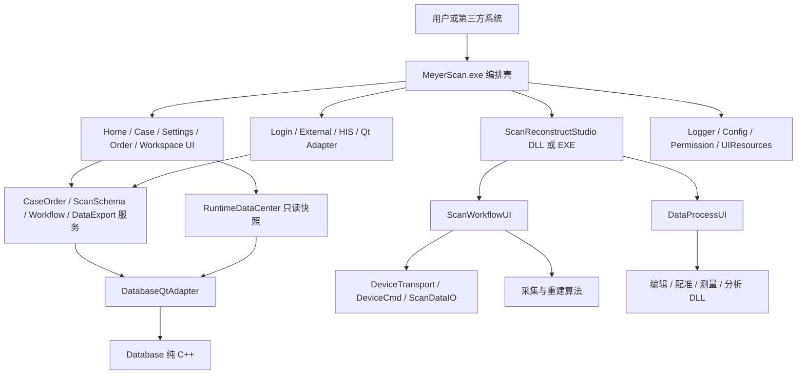

# MeyerScan 架构设计与接口规范

> **文档职责**：规定模块依赖、运行时边界、数据合同、接口稳定性、资源生命周期和集成规则。
>
> 完整模块中文名、项目名、产物和功能说明只在 `MeyerScan重构任务总览.md` 维护，本文不再复制同一张大表。
>
> **唯一维护位置**：`F:\MeyerScan\Documents`。公共头文件和可编译代码是接口实现的最终事实来源。

## 1. 架构目标

1. 人工可读优先：一个模块只处理一类问题，代码量和依赖保持可理解。
2. 边界优先：是否使用 Qt 不是第一判断，UI、业务、数据、设备和算法不能越层。
3. 轻量化：只在独立变化、独立资源、独立依赖或独立交付确实存在时拆模块。
4. 可替换：MainExe 不静态绑定大量业务 DLL；外部/长期接口使用稳定 ABI。
5. 可验证：每个模块可独立构建、测试、记录版本和排查日志。
6. 可恢复：配置、数据库、插件、进程和升级失败都有明确失败合同，不留下半更新状态。

## 2. 分层架构



### 2.1 分层与模块归属

| 层 | 当前模块 | 允许职责 |
|---|---|---|
| 主宿主/编排 | `MyMainExe` | 启动、单实例、登录、模块生命周期、页面挂载、轻量流程和进程调度 |
| UI 容器 | `MyOrderScanWorkspaceShell`、`MyScanReconstructStudio` | 页面容器、步骤导航、激活/释放，不实现步骤业务 |
| 业务 UI | Home、Case、Settings、OrderCreate、ScanWorkflow、DataProcess、Send、两校准 UI | 展示、输入、局部交互、动作上报 |
| 业务服务 | CaseOrder；规划中的 ScanSchema、OrderWorkflow、DataExport、Statistics | 业务校验、事务、状态、结构化查询和动作结果 |
| 运行时读模型 | RuntimeDataCenter | 常用数据和云端信息的只读快照 |
| 适配层 | DatabaseQtAdapter、ExternalLaunchAdapter；规划中的 Login/HIS Adapter | 类型、协议和来源差异转换 |
| 基础设施 | Logger、Database、ConfigCenter、Permission、UIResources | 通用能力，不理解页面流程 |
| 设备与算法 | 已落地 DeviceTransport；规划中的 DeviceCmd、ScanDataIO、PreProcess 和处理工具 DLL | 硬件通信、数据 IO、算法和纯数据处理 |
| 独立进程 | ScanReconstructStudio.exe、MyUpdate.exe、安装器 | 隔离高资源/更新/交付边界 |

### 2.2 依赖方向

- 依赖只能从上层指向下层；Database、Logger 等基础设施不能反向依赖 UI 或业务服务。
- UI 不能直接访问 Database、SQL、配置文件或权限规则文件。
- RuntimeDataCenter 只为读取优化，写操作必须走 Service。
- Adapter 只转换数据/协议，不拥有业务状态和页面。
- MainExe 可以编排服务和 UI，但不能成为业务规则仓库。
- Scan/Process UI 不持有设备协议和重算法实现，只调用对应接口。
- 两个模块互相调用并不等于应合并；是否合并取决于职责、变化原因、依赖和资源生命周期。

## 3. 模块拆分判定

满足以下任一条件时可考虑拆分：

- 需要独立替换、定制、版本或发布。
- 有独立且较重的第三方依赖，例如 VTK、设备 SDK 或算法库。
- 有独立资源生命周期，例如显存、大模型、线程或进程。
- 与调用者的变化原因不同，且接口可以稳定。
- 至少两个调用方需要复用同一能力。
- 单模块已经难以人工阅读、测试或定位问题。

以下情况不拆：

- 只有几行转发代码，没有独立规则或依赖。
- 只是为了减少单文件行数，却增加跨 DLL 调试和版本成本。
- 接口尚不稳定，拆分后会频繁同步修改所有调用方。
- 只能以万能 Common/Manager/Helper 命名，职责无法一句话说明。

拆分后仍需检查：调用链是否更清楚、测试是否更简单、依赖是否单向、失败是否能独立定位。若答案是否定，应留在原模块或使用私有类/源文件分层。

## 4. 动态加载与生命周期

### 4.1 MainExe 插件加载

自研功能 DLL 默认使用：

1. 根据 `applicationDirPath()` 组成绝对路径。
2. `QLibrary`/Win32 加载 DLL。
3. 解析稳定的 `extern "C"` 工厂函数和 `GetMeyerModuleVersion()`。
4. 校验接口版本、初始化参数和返回值。
5. 记录加载路径、版本、成功/失败和降级结果。
6. 宿主持有 DLL 句柄，插件对象销毁后才能卸载 DLL。

MainExe 不链接这些插件的 import lib，只包含公共接口头。确实需要静态链接的低层库必须说明原因，不把“动态加载”机械套到所有代码。

### 4.2 标准生命周期

推荐顺序：

`Load -> ResolveFactory -> GetInterface -> Init -> SetContext -> CreateWidget -> Activate -> DeactivateAndRelease -> Shutdown -> DestroyInterface -> Unload`

- `Init`、`SetContext`、`CreateWidget` 都必须返回可判断的结果。
- `CreateWidget` 只创建页面，不隐式启动相机、线程或重算法。
- 页面真正挂载并可见后由宿主调用 `Activate()`。
- 重页面离开时调用 `DeactivateAndRelease()`，先停事件/线程，再释放 VTK/OpenGL/模型，最后销毁 QWidget。
- Qt `deleteLater()` 依赖事件循环；需要立即释放重资源时必须提供显式释放接口，不能只等延迟析构。
- 插件对象、回调和 QWidget 全部销毁后才能卸载 DLL，避免函数指针或虚表指向已卸载代码。

### 4.3 页面所有权

- MainExe 只维护一个全屏内容区；Home 与 Case 不是长期并列的 `QStackedWidget` 缓存页。
- Home、Case 和 WorkspaceShell 各自拥有符合页面语义的顶部区域，MainExe 只执行窗口动作。
- WorkspaceShell 是 Order/Scan/Process/Send 步骤条的唯一所有者，子页面不得重复绘制步骤导航。
- SettingsUI 是临时覆盖/对话流程，必须携带 `sourcePage`；关闭后由 MainExe 决定刷新谁。
- CaseUI 进入扫描前必须析构，不能只隐藏。

## 5. 跨模块接口合同

### 5.1 边界类型选择

| 场景 | 推荐类型 | 禁止内容 |
|---|---|---|
| 同进程、同 Qt/编译器、受控 MeyerScan 模块 | QString、QByteArray、QJson 可作为便捷重载；底层仍建议稳定接口 | QObject/QWidget 所有权不清、跨 DLL 释放对方分配的对象 |
| 自研插件公共 C ABI | `const char*` UTF-8、POD、枚举、调用方缓冲区、稳定接口指针 | 暴露 STL 容器、异常、模板 ABI、由另一侧 delete 的内存 |
| 跨进程 IPC | 版本化 JSON/二进制消息、文件路径、订单 ID、数据句柄 | QString 指针、QObject、VTK 对象、大块模型内存所有权 |
| 第三方 SDK/API | 明确长度的 UTF-8、POD、错误码、调用方缓冲区 | 内部类、私有数据库结构和无版本消息 |

Qt 模块调用 C ABI 时，临时 UTF-8 数据必须先保存为命名 `QByteArray`，再传 `constData()`；不能让被调用方保存该临时指针。需要长期保存时由接收方复制。

### 5.2 缓冲区接口

可变长输出统一采用两次调用或明确容量：

1. 调用方传空缓冲区查询所需字节数。
2. 调用方分配缓冲区并再次调用。
3. 返回值区分成功、容量不足、无数据和业务错误。
4. 输出 UTF-8 必须包含终止符规则，并写在公共头注释中。

禁止返回指向函数局部 `std::string`、临时 `QByteArray` 或临时 JSON 的指针。模块内部需要返回稳定 `const char*` 时，使用明确生命周期的成员缓存，并标注下一次调用是否覆盖。

### 5.3 回调

- C 回调包含 `userData`，由调用方恢复上下文。
- 动作使用稳定英文 ID，例如 `home.create`、`workspace.step.scan`，显示文案由 UI 翻译。
- 注册和注销时机明确；宿主销毁前先清空插件回调。
- Qt 信号连接中的 lambda 捕获对象必须有 QObject context 或显式断开，防止页面销毁后继续回调。

### 5.4 错误合同

- 公共接口不得只靠日志表示失败，必须返回 bool/错误码/Result。
- 错误至少区分：参数错误、未初始化、依赖缺失、版本不兼容、解析失败、权限拒绝、数据库失败、资源不足和内部错误。
- 调用方必须检查返回值，决定重试、降级、回退页面或终止流程。
- DLL 边界不抛出 C++ 异常；内部捕获后转换为错误码并记录日志。
- 可选依赖失败时清空旧接口指针和能力状态，不能继续使用上一次成功结果。

## 6. 版本化 JSON 合同

### 6.1 通用结构

易变化数据使用 UTF-8 JSON，最少包含：

```json
{
  "schemaVersion": 1,
  "source": {},
  "data": {},
  "extensions": {}
}
```

- `schemaVersion`：决定解析和迁移策略。
- 稳定字段：常用且有明确业务含义的 key。
- `extensions`：客户/第三方新增字段，避免每次扩展公共 ABI。
- 未识别字段默认保留或忽略，不能导致旧版本崩溃。
- 修改合同必须同时更新生产者、消费者、示例、测试和文档。

### 6.2 标准建单上下文

顶层固定为：

- `source`：入口类型、`thirdPartyType`、来源名称/系统/版本、外部 ID。
- `patient`：患者稳定字段和扩展字段。
- `order`：订单稳定字段、医生/诊所/技工所引用和状态。
- `scanPlan`：治疗类型、FDI 牙位、桥、咬合和材料等。
- `scanProcess`：扫描步骤 `steps` 及生成配置。

OrderCreateUI 接收标准上下文，不理解第三方私有字段。External/HIS Adapter 负责归一化；CaseOrderService/ScanSchemaService 负责正式保存；Workflow 决定后续步骤。

### 6.3 事务式更新

收到新 JSON 时：

1. 解析到候选对象。
2. 验证 schema、类型、必填字段、范围和引用关系。
3. 完整成功后一次性替换当前状态。
4. 任一步失败则保留上一份有效状态并返回错误。

该规则适用于建单上下文、权限、配置、IPC 状态和云端快照。

## 7. 数据架构

### 7.1 标准访问链路

```text
MyCaseUI / MySettingsUI / MyOrderCreateUI
        -> RuntimeDataCenter（只读）或业务 Service（读写）
        -> MyDatabaseQtAdapter（Qt/C++ 转换）
        -> MyDatabase（连接、SQL、事务）
```

- Database 不知道业务表语义。
- DatabaseQtAdapter 不知道字段含义。
- Service 负责 SQL/schema、业务校验、事务、状态和审计。
- RuntimeDataCenter 缓存高频只读数据，不接收 SQL 或表名。
- UI 只消费 DTO/JSON 和提交动作。

### 7.2 数据归属

| 数据 | 所有者 | 读取方式 |
|---|---|---|
| 患者、订单 | CaseOrderService | 列表可用 RuntimeDataCenter 快照；搜索/详情/写入走 Service |
| 诊所、医生、技工所 | CaseOrderService 参考数据 | RuntimeDataCenter 快照或 Service 查询 |
| 软件设置、账号、设备 | 对应服务；骨架期由 RuntimeDataCenter 读入 | UI 不直接读表 |
| 扫描方案 | ScanSchemaService | OrderCreate/Workflow/Scan 读取标准合同 |
| 云端诊所信息 | 登录/云同步模块写入 RuntimeDataCenter | 其他模块读取只读云端快照 |

患者和订单字段变化频繁，因此不创建固定字段 CaseEntity.lib。服务合同通过 `schemaVersion + stable keys + extensions + 数据库迁移` 演进。

### 7.3 数据库切换

- 当前默认 SQLite；Database 保留 MySQL 类型和配置边界。
- 数据库类型由 ConfigCenter/部署配置决定，UI 不直接切换底层连接。
- 切换前必须关闭查询/事务、清理连接、验证目标配置并记录结果。
- schema 变更通过版本化迁移执行，不能依赖用户手工运行旧 `mysql.sql`。

## 8. 配置与权限

### 8.1 两类 JSON

| 文件 | 作用 | 示例 |
|---|---|---|
| `runtime_config.json` | 产品行为、客户默认值和可调参数 | 数据库类型、路径、主题、语言、功能默认策略 |
| `permission_rules.json` | 当前授权结果和功能规则 | `featureId`、`visible`、`enabled`、约束条件 |

配置回答“产品怎么运行”，权限回答“当前用户/客户/设备能否使用”。同一功能可以配置为默认开启，但权限最终拒绝。

`singleInstance` 和启动等待页属于固定流程，不放入 runtime config。JSON 不写注释；字段说明放同目录 Markdown。

### 8.2 visible 与 enabled

- `visible=false`：入口不创建或隐藏，用户不可见。
- `visible=true, enabled=false`：入口显示但不可操作，可用于提示未授权/条件不满足。
- `visible=true, enabled=true`：UI 可发起动作，但高价值动作仍需后端复核。

UI 的按钮权限集中在 `ApplyPermissions()` 或少量按时机拆分的函数中，禁止散落到每个点击槽。

### 8.3 六维权限

当前目标维度：角色/账号、客户/诊所、设备型号与编号、软件版本/产品包、时间有效期、配置/授权方案。流程为：

1. 登录、许可和设备信息形成权限输入快照。
2. Permission 加载规则并生成不可变权限快照。
3. MainExe 把页面所需权限上下文注入 UI。
4. UI 应用 visible/enabled，改善体验。
5. MainExe 在导航和插件加载前复核。
6. Service/Workflow 在保存、删除、扫描、导出、校准、升级等动作前复核。
7. 独立进程/IPC 对高价值命令再次复核，不信任 UI 传来的“已授权”。
8. 拒绝和命中规则写日志，但不泄露敏感规则全文。

定制客户和功能阉割不能只删除按钮或只改 JSON；至少需要 UI + 编排/服务两层生效，关键功能需要 IPC/进程层第三次校验。

## 9. UI 架构

### 9.1 分辨率与布局

- 以 1920x1080 作为设计基准可以保留，但不能对所有控件坐标和尺寸整体乘系数。
- 页面必须使用 Qt Layout、伸缩因子、sizePolicy、最小/最大宽高、滚动区和内容优先级。
- DPI 工具只提供离散图标、间距、边距和触控区域尺寸。
- 固定格式区域使用稳定约束，动态文字不能推动工具栏、牙弓、步骤条或 VTK 视区跳动。
- 验证分辨率至少为 1366x768、1920x1080、2560x1440；高 DPI 图片按资源档位选择。

### 9.2 多语言

- 所有可见字符串写 `tr("English source text")`。
- 模块维护自己的业务 qm；公共控件/弹窗文案由 UIComponents/Common qm 管理。
- 禁止按语言写位置/大小 if/else；通过布局、换行、省略号、tooltip 和合理最小宽度吸收文本增长。
- 切换语言时由统一 LanguageManager 规划通知，模块响应 `LanguageChange` 更新文本。

### 9.3 样式和资源

- 业务源码禁止直接 `setStyleSheet()`；统一 QSS 加载入口是唯一例外。
- QSS 使用 `role`、`layout`、`state` 等动态属性表达按钮类型，不为每个页面复制样式。
- 各模块资源源码位于 `Resources/icon`、`Resources/qss`、`Resources/qm`。
- 构建时由 MyUIResources 聚合并嵌入 `MeyerScan_UIResources.dll`。
- 运行时先注册资源 DLL，再加载 QSS/图片；资源加载失败记录路径、资源 ID 和降级结果。
- 当前保持一个 UIResources DLL，不拆 Icon.dll/Qss.dll，避免重复加载和非原子升级。

### 9.4 共享和专用控件

进入 UIComponents：通用按钮角色、标签、输入、下拉、日期、开关、表格基础行为、等待页、普通确认弹窗和 Toast。

留在业务模块：牙位 mask 交互、扫描工具、VTK 视区、治疗类型资源合成、只在一个模块使用的复杂业务控件。

公共虚接口扩展只允许在末尾追加函数，或通过接口版本新增 V2；禁止在中间插入函数改变虚表布局。

## 10. 扫描重建架构

### 10.1 双形态

- `MeyerScan_ScanReconstructStudio.dll`：嵌入 MeyerScan 创建/练习流程，进程内传标准上下文。
- `ScanReconstructStudio.exe`：独立练习/定制/SDK 场景，使用版本化 IPC。
- 两种产物共用同一窗口和阶段编排代码，禁止复制两套 Scan/Process 实现。

### 10.2 阶段职责

- ScanWorkflowUI：流程选择、扫描控制、提示、数据显示、设备/算法动作上报。
- DataProcessUI：处理工具入口、提示、数据显示、处理动作上报；不出现扫描 Start/Pause。
- ScanReconstructStudio：装载、切换、上下文转发和重资源释放。
- 设备、采集、重建、编辑、分析分别由下层能力接口实现。

### 10.3 数据与 IPC

- 控制消息传订单 ID、步骤 ID、状态、进度、错误和数据文件/共享内存句柄。
- 不通过 JSON 传大块网格、图像或 VTK 对象。
- IPC 消息含 `schemaVersion`、`requestId`、`command`、`payload` 和结果/错误。
- 当前看门狗只关注 MeyerScan 与扫描进程的信息传输和状态同步，不把超时自动重启作为重点。
- 独立 EXE 异常退出后 MainExe 记录订单、步骤、退出码和最近 IPC 状态，并提供用户可理解的恢复入口。

### 10.4 显示交互

- 流程按钮代表扫描部位，必须有手型光标、tooltip、选中态，并切换对应数据。

### 10.5 设备传输边界

- `MyDeviceTransport / MeyerScan_DeviceTransport.dll` 当前只实现 Windows x64 CyAPI USB；公共接口使用 `MeyerDeviceTransport_*` C ABI。
- 公共结构必须包含 `structSize + schemaVersion + reserved`，只传固定宽度整数、UTF-8 和调用方缓冲区；C++ 异常、STL、CyAPI 类型不得越过 DLL 边界。
- DeviceTransport 负责连接、重连、原始命令字节、原始流、异步队列、包同步和完整帧交付，不解释“曝光/开灯/固件”等命令业务语义；命令组装与响应语义属于 `MyDeviceCmd`。
- 采集工作线程使用原子停止标志；完整帧队列必须有上限。停止/销毁顺序固定为：停止采集线程 -> 中止并 Finish 异步传输 -> 关闭事件/缓冲区 -> 关闭设备。
- 采集尺寸、包数量、异步队列、超时、完整帧和总内存预算必须在进入 CyAPI 前校验；涉及尺寸的乘法使用 64 位中间值。当前公共上限统一定义在 `DeviceTransport.h` 的 `MEYER_DEVICE_TRANSPORT_MAX_*` 常量中。
- `MeyerDeviceTransport_GetFrame` 固定为非阻塞接口：无完整帧立即返回 `NotReady`，不得在 DLL 调用线程中按采集超时休眠；轮询节奏由 UI/扫描编排层决定。
- IMU 姿态处理当前作为私有兼容子层存在，不暴露算法对象；若后续出现独立复用或算法快速变化，再拆为单独能力 DLL。
- 模块可选运行时加载 `MeyerScan_Logger.dll`，路径按 EXE/DLL 加载规则解析，不依赖 current directory。轮询 `NotReady`、超时和缓冲区长度探测不得形成日志风暴。
- Scan 和 Process 使用同一份 `scanProcess.steps`，但各自维护提示内容。
- 滚轮以鼠标所在位置为缩放中心，缩放值在应用前夹紧；禁止先越界再动画拉回。
- 页面离开先断开交互和定时器，再释放 renderer、renderWindow、QVTKWidget 和模型缓存。

## 11. 日志、路径和版本

### 11.1 日志合同

- Logger.dll 纯 C++；每个进程初始化一次，每个模块缓存借用指针。
- 同一进程所有模块写 `logs/MeyerScan_YYYYMMDD.log`，超限后 `_001`、`_002`。
- 每条日志加锁、写入、flush、关闭，保证文件可被后台移动/删除。
- 只输出非空字段，结构化分类至少覆盖时间、级别、Module、Operation、Content，可选 Dev/Case/Op。
- 正常高频循环不逐帧写日志；关键动作、状态变化、失败和资源生命周期必须写。

### 11.2 路径合同

- 运行根目录来自 EXE/模块实际路径，禁止依赖 current working directory。
- MainExe 和 Qt 模块使用 `applicationDirPath()`；纯 C++ DLL 使用 Win32 模块路径或宿主注入路径。
- 测试宿主也从自身 EXE 目录推导配置、日志和资源，不写死 `F:\MeyerScan`。

### 11.3 版本合同

- 每个自研 DLL/EXE 同时有 `Version.rc` 文件版本和代码版本。
- `ModuleInfo::Version`、业务接口 `GetModuleVersion()`、`GetMeyerModuleVersion()` 和 `Version.rc` 必须一致。
- `version_modules.json` 是启动版本清单白名单，只列自研拆分模块；不扫描 Qt、VTK、OpenCV、VC/UCRT 等第三方库。
- 运行清单记录 fileVersion、codeVersion、versionMatch、文件大小和修改时间，写入 `logs/versionList`。
- 版本不一致是构建/打包失败，不允许只记录后继续发布。

## 12. 更新与安装边界

- MyUpdate.exe 独立于 MainExe，负责策略比较、补丁下载、校验、关闭、覆盖、回滚和重启。
- MainExe 只生成/提供本地信息并启动更新器，不执行自覆盖。
- 安装器从明确的发布清单收集自研模块和第三方运行依赖，不能扫描开发机目录临时拼包。
- UIResources、模块 DLL 和配置模板必须作为一致批次安装；更新失败不能留下新旧资源混用。
- 正式阶段增加哈希、数字签名、安装修复、升级回滚和卸载数据保留策略。

## 13. 构建、测试和可读性合同

### 13.1 双构建入口

- 每个活跃模块保留 VS2015 `.sln/.vcxproj` 和 CMakeLists。
- 根 `MeyerScan_AllModules.sln` 与根 CMake 聚合相同模块和测试。
- Qt/VTK/OpenCV 路径集中在公共 props/cmake；模块项目不散落个人绝对路径。
- VS2015 和 CMake 当前写相同模块输出目录，必须串行构建，避免 LNK1104。

### 13.2 测试层级

| 层级 | 要求 |
|---|---|
| 单模块 | 每个 DLL 有 Test.exe/smoke，覆盖 Init、版本、有效/无效输入和 Shutdown |
| 集成 | MainExe 内部导航、第三方建单、Database-Service-UI 链路 |
| UI | 固定分辨率截图、文字裁切、控件重叠、步骤切换和资源释放 |
| 数据 | 临时数据库/目录，测试前后验证正式配置和数据哈希不变 |
| 稳定性 | 重复进出页面、反复 Scan/Process、异常 DLL/JSON/IPC、长时间运行 |
| 发布 | 版本一致性、依赖完整性、安装/升级/回滚和干净机器启动 |

根 CTest 是快速回归入口，不替代真实设备、算法、数据库、UI 截图和安装验收。

### 13.3 注释

- 每个函数有中文功能注释。
- 关键实现解释使用的技术、生命周期、缓冲区和为什么这样写。
- 初学者仅看当前文件也应理解主要路径，但不逐字翻译显而易见语法。
- `//` 注释独占物理行，末尾禁止反斜杠；第三方源码不改，自研适配层必须解释第三方调用。

## 14. 禁止事项

- UI 直接 SQL/Database、UI 自己保存配置或实现权限核心。
- MainExe 堆积患者/订单、扫描方案、设备或算法规则。
- Adapter 实现业务 CRUD，RuntimeDataCenter 接收任意 SQL。
- 跨 DLL 返回临时指针，或让另一模块释放本模块分配的 STL/Qt 对象。
- 跨进程传 QObject、QString 指针、VTK 对象或大块内存所有权。
- 源码内联业务 QSS、`tr("中文")`、按语言写布局分支、使用 `QDir::currentPath()`。
- 只隐藏按钮实现功能阉割，或信任 UI 传来的授权结果。
- 页面隐藏但不释放扫描、案例、VTK、线程和模型资源。
- 示例患者/订单进入正式路径，测试覆盖正式配置、数据库或版本清单。
- DLL/EXE 没有版本、测试宿主、README/CHANGELOG 就进入集成。
- 为缩短单文件而创建无独立职责的 DLL，或把各种工具塞进 Common/Helper。

## 15. 当前架构优先事项

1. LoginAdapter 隔离既有登录 ABI。
2. CaseOrderService + ScanSchemaService + OrderWorkflowService 完成真实患者订单闭环。
3. SettingsUI 通过版本化上下文完成读取、保存、恢复和来源页刷新。
4. Permission 完成六维快照和多层复核。
5. 独立 ScanReconstructStudio EXE 建立最小 IPC，再接设备、算法、数据 IO 和处理工具。
6. DataExport/Network/Send 打通后，再实施 MyUpdate 和安装器。

---

> **文档版本**：v3.0（2026-07-14，移除历史候选头文件和重复方案，收敛为现行架构合同）
