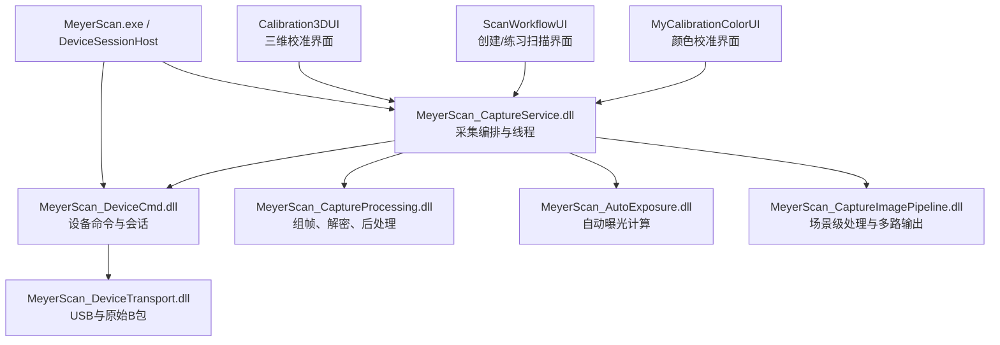
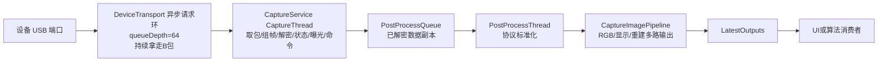
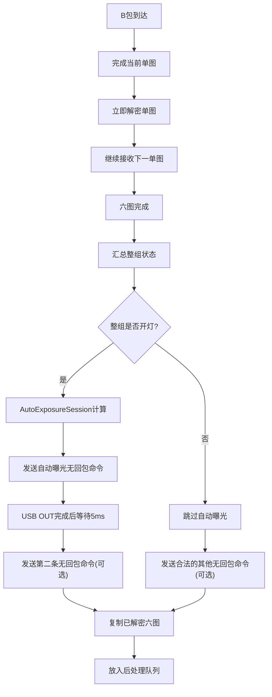

# 数据采集与原始图像预处理方案

> 文档性质：设备采集链路的架构、数据流、时序、模块边界和验证合同。
>
> 当前状态：基础代码已按方案落地并通过模拟 smoke；真实设备连续采集、时序和图像质量尚未联调。
>
> 文档版本：v1.4（2026-07-24；落地 CaptureService、CaptureProcessing、CaptureImagePipeline 和 AutoExposure 接口）
>
> 维护位置：`F:\MeyerScan\Documents\设备相关`。旧的 `D:\wj\重构文档` 不再作为现行方案来源。

## 1. 目的和适用范围

口扫设备数据采集是颜色校准、三维校准、练习扫描和创建扫描的共同基础能力。本方案统一规定以下内容：

- USB 原始 B 类图像包的持续接收方式。
- 单图组装、六图组帧和错序恢复。
- 单图数据头解析和整组状态汇总。
- 单图解密、自动曝光计算和曝光命令下发时序。
- 图像排序、相机镜像、白图减黑图等慢速后处理。
- 设备相关模块的职责、依赖方向和数据所有权。
- 设备机型系列、设备编号、设备型号在链路中的保存和传递方式。
- 队列、线程、日志、错误恢复和测试要求。

本方案当前覆盖 `mOS MyScan 5`、`mOS MyScan 5H` 和 `mOS MyScan 6`。旧 `mOS MyScan` 代码保留用于识别和诊断，但不属于本次重构软件的正式采集适配范围。

## 2. 已确认的设计结论

### 2.1 核心结论

1. `MyDeviceTransport` 只负责 USB 连接、原始命令字节和原始 B 包传输，不负责图像业务语义、解密、曝光算法或 UI。
2. 采集期间必须持续从 USB 端口取走数据，不能为了发送命令而长时间暂停接收。设备 USB 缓冲区容量有限，停止及时取包会导致设备采集异常。
3. 一个 USB 异步传输严格对应一个 `16384` 字节 B 包。所有当前适配机型暂统一使用 `queueDepth=64`，即同时预提交 64 个 USB IN 接收任务；接收任务环持续运行并允许跨越组六图边界。`queueDepth` 只表示 USB 在途接收缓冲数量，不等同于图像数量、组六图数量或后处理队列容量。
4. 单图完成后立即解密，充分利用相邻单图之间的间隔；六张图完成后不再进行整组六图的集中解密，只执行状态汇总和自动曝光计算。
5. 自动曝光不是每组图都执行。整组只要有一张图关灯，整组就视为关灯，不进入自动曝光，也不发送自动曝光命令；但该组六图仍正常复制到慢速后处理队列，执行排序、镜像、减黑图并将结果正常传递给 UI/算法消费者。
6. 整组开灯时，使用同一个采集会话级 `AutoExposureSession` 计算曝光参数。
7. 一组六图的间隔内最多发送两条无回包命令。自动曝光命令符合条件时优先发送；自动曝光被跳过时，仍允许发送队列中的开灯、关灯等合法无回包命令。
8. 第一条命令的完成条件暂定为 USB OUT 传输完成。第一条命令完成后，至少等待 `5 ms`，再发送第二条命令。
9. 图像排序、Y 轴镜像、白图 RGB 减黑图属于慢速后处理，使用已解密数据的独立副本异步执行，不阻塞 USB 接收、自动曝光和命令下发。
10. 后处理队列满时，仍完成 USB 接收和快速链路；开灯组照常完成自动曝光，关灯组照常跳过自动曝光。此时只丢弃新的后处理副本，不删除已经进入队列的旧数据。
11. MyScan 6 当前使用与 MyScan 5 25 帧模式相同的参数值，但必须保存为独立 Profile 和独立变量，不能引用 MyScan 5 的可变对象。
12. `CaptureProcessing` 只负责协议级标准化；标准化六图之后的 RGB888、颜色校准、AI 软组织、除色和粗条纹等场景级处理统一进入 `CaptureImagePipeline`。
13. `CaptureService` 只负责编排、队列、选项快照和结果发布，不直接堆放图像算法。高级算法尚未接入时必须返回明确不可用状态，不能伪造结果。

### 2.2 事实、暂定值和待验证项

| 分类 | 内容 |
|---|---|
| 已确认事实 | USB 一个异步传输对应一个 16384 字节 B 包；设备连续把数据放入 USB 端口；当前软件使用 `queueDepth=64`；当前软件已验证 MyScan 5 25 帧模式可以在组间隔内完成快速链路和两条命令发送 |
| 已确认规则 | 自动曝光只对整组开灯数据执行；关灯组仍正常后处理并发布 UI；两条无回包命令间隔至少 5 ms；后处理队列满丢弃新副本；减黑图结果限制在 `[0,255]` |
| 当前暂定 | MyScan 5、MyScan 5H 和 MyScan 6 等所有当前适配机型统一使用 `queueDepth=64`；后续只有实机数据证明需要差异化时才修改对应 Profile |
| 当前暂定 | MyScan 6 的分辨率、图像幅数、包数、包大小、组间隔等初始值与 MyScan 5 25 帧模式相同 |
| 当前暂定 | MyScan 5H 复用 MyScan 5 的采集和解密规则，但使用独立机型 Profile |
| 待实机验证 | MyScan 5 的 18/20/22 帧模式实际组间隔和快速链路耗时 |
| 待实机验证 | MyScan 6 实际数据头、图像包和加解密规则是否完全等同于 MyScan 5 |
| 待实机验证 | USB OUT 完成后设备内部应用曝光参数的具体时刻；当前不要求无回包命令提供设备应用确认 |
| 后置验证 | 使用真实设备对照旧软件验证 AES 解密结果；代码阶段先保留自动化测试入口和诊断日志 |

### 2.3 命令间隔的作用域

本方案中存在两类不同的等待窗口，必须按链路分别实现和记录：

- **低频设备信息命令**：读取设备编号、型号、版本等命令在上一条命令没有收到并解析出普通合法帧或业务可识别终态时，使用 `20 ms` 兜底等待；如果已经收到合法终态，不再额外等待。D4/D9、CD/CE 发送后到开始接收的 `50 ms` 也属于当前命令的接收时序，不是通用命令间隔。
- **采集组六图间隔**：自动曝光、开关灯等无回包命令在一组图结束后的命令窗口内最多发送两条；第一条 USB OUT 完成后，第二条开始前至少等待 `5 ms`。该 `5 ms` 不替代低频命令的 `20 ms` 兜底，也不能反向套用到低频命令。

采集窗口的 `5 ms` 是当前已确认的最小安全间隔；真实间隔、命令 USB OUT 耗时和命令窗口剩余时间必须写入采集诊断日志。任何把两类等待合并成一个全局常量的实现都视为方案偏移。

## 3. 总体架构

### 3.1 模块依赖图



依赖方向必须保持单向：

```text
UI -> CaptureService -> DeviceCmd -> DeviceTransport
                         |-> CaptureProcessing
                         |-> AutoExposure
                         |-> CaptureImagePipeline
```

以下依赖禁止出现：

- UI 直接加载 `DeviceTransport.dll`。
- UI 直接持有 USB 句柄。
- `CaptureProcessing.dll` 反向调用 `DeviceCmd.dll`。
- `AutoExposure.dll` 直接发送设备命令。
- `DeviceTransport.dll` 依赖 Qt、UI、订单或扫描算法。

### 3.2 线程和队列图



线程职责：

- `DeviceTransport` 内部维护 64 深度异步 USB IN 请求环；完成槽位复制给 CaptureService 后立即重新提交。
- `CaptureService CaptureThread` 串行取出一个 B 包并推进快速状态机，是自动曝光和命令调度的唯一控制线程。
- `PostProcessThread` 负责慢速图像处理，不能反向阻塞快速链路。
- UI 线程只读取最终结果并刷新 Qt 控件。

第一版不额外建立用户态 `RawPacketQueue`。底层 64 个在途接收槽吸收快速线程的短时处理延迟，CaptureService 仅维护后处理队列；只有实机数据证明取包线程因解密或曝光计算不能及时消费完成槽时，才增加独立 RawReceiveThread。

`queueDepth=64` 表示传输层同时预提交 64 个、每个对应一个 `16384` 字节 B 包的 USB IN 请求，在途缓冲总量约为 `64 * 16384 = 1048576` 字节。接收任务完成后必须及时重新提交，以维持 64 深度的请求环。当前代码没有第二个用户态 `RawPacketQueue`，不能把 `queueDepth` 解释为图像数、组六图数或后处理队列容量。

### 3.3 快速链路和慢速链路



快速链路只包含设备控制必须的工作：组帧、单图解密、状态汇总、条件式自动曝光和最多两条命令。排序、镜像、减黑图不进入快速链路。

无论整组开灯还是关灯，只要组六图完整且解密成功，都必须复制已解密六图并尝试进入慢速后处理队列。关灯状态只控制是否执行自动曝光，不能阻止慢速后处理或 UI 结果发布。

## 4. 设备信息上下文合同

所有设备命令模块和数据处理模块都必须在会话上下文中记录当前设备身份。不能只记录一个最终显示名称。

### 4.1 必须字段

| 字段 | 是否必须 | 含义 |
|---|---|---|
| `deviceSeries` | 必须 | 机型系列，例如 `mOS MyScan 5`、`mOS MyScan 6` |
| `deviceProfile` | 必须 | 协议和采集 Profile，例如 `MyScan5`、`MyScan5H`、`MyScan6` |
| `deviceId` | 有则记录 | 13 位正式设备编号；生产模式可能为空 |
| `deviceIdStatus` | 必须 | 已写入、未写入长度异常、未写入校验异常、读取失败等 |
| `deviceModel` | 有则记录 | 具体产品型号，例如国内标准版、P1、P2 |
| `modelCode` | 有则记录 | 设备型号命令解析出的完整型号代码 |
| `reported*` | 必须保留 | 设备真实回包得到的值 |
| `effective*` | 需要兼容时记录 | 当前流程允许使用的有效值，必须带来源 |
| `productionMode` | 必须 | 是否生产模式，以及判定证据 |
| `firmwareVersion` | 有则记录 | 主控板版本，必要时包含投图板版本 |
| `scanHeadType` | 采集组必须记录 | 大、小或未插入，以及单图原始值 |
| `captureMode` | 采集会话必须记录 | 颜色校准、三维校准、练习扫描或创建扫描 |
| `profileVersion` | 必须 | 采集参数和处理规则版本 |

### 4.2 各模块记录责任

| 模块 | 设备系列 | 设备编号 | 设备型号 | 其他职责 |
|---|---|---|---|---|
| `MyDeviceTransport` | 每个打开/流会话必须记录 | 有则透传，不解析 | 有则透传，不解析 | 记录原始传输上下文、USB 速率、队列和错误 |
| `MyDeviceCmd` | 必须识别并保存 | 负责 D4/D9 解析和状态 | 负责 CD/CE 和产品目录解析 | 保存 reported/effective、生产模式、固件和命令诊断 |
| `MyMainExe/DeviceSessionHost` | 必须 | 复制快照 | 复制快照 | 进程唯一设备会话和工作流准入 |
| `MyCaptureService` | 采集会话必须 | 有则记录 | 有则记录 | 选择 Profile、维护会话和快速链路 |
| `MeyerScan_CaptureProcessing.dll` | 每组输入必须带 | 有则复制 | 有则复制 | 数据头、组帧、解密、后处理和 Profile 分支 |
| `MeyerScan_AutoExposure.dll` | 每次计算必须带 | 有则带入诊断 | 有则带入诊断 | 按系列、型号、模式、扫描头选择计算策略 |
| `MeyerScan_CaptureImagePipeline.dll` | 每组输入必须带 | 有则复制 | 有则复制 | 标准化六图后的 RGB、显示、重建和场景算法输出 |
| `MyCalibrationColorUI` | 宿主注入后必须显示/记录 | 有则显示/记录 | 有则显示/记录 | 不连接设备、不解析原始回包 |
| `MyCalibration3DUI` | 宿主注入后必须显示/记录 | 有则记录 | 有则记录 | 只发起三维校准动作 |
| `MyScanWorkflowUI` | 每个扫描会话必须消费 | 有则记录 | 有则记录 | 不实现设备命令和采集算法 |
| `MyDataProcessUI` | 处理上下文必须带入 | 有则记录 | 有则记录 | 不重新探测设备，不创建 USB 会话 |
| `MyOrderScanWorkspaceShell` | 工作台上下文必须保留 | 有则转发 | 有则转发 | 在 Order/Scan/Process/Send 间传递不可变快照 |

日志和结果中至少同时出现：

```text
deviceSeries
deviceProfile
deviceIdStatus
deviceId（有则记录）
deviceModel/modelCode（有则记录）
productionMode
captureMode
```

### 4.3 数据所有权

第一版优先安全和完整性，允许发生明确的深复制：

```text
USB异步接收槽
    -> CaptureService当前B包副本
当前组六图工作缓冲区
    -> 已解密六图缓冲区
    -> 后处理副本
    -> 标准化六图副本
    -> Pipeline 显示/重建等具名输出副本
```

跨 DLL 不传递 `std::vector`、`QString`、`QObject` 或需要对方释放的内存。优先使用调用方分配、被调用方填充的固定布局 POD 和显式容量。

## 5. 采集 Profile

### 5.1 MyScan 5 逻辑图像和传输参数

当前已确认的 MyScan 5 单图规则：

```text
逻辑尺寸：1024 x 455
逻辑总字节：1024 x 455 = 465920
前 40 字节：数据头，不加密
图像内容：465880 字节
单包大小：16384 字节
每张图包数：29
传输总字节：16384 x 29 = 475136
最后一包有效字节：465920 - 16384 x 28 = 7168
填充字节：9216
```

必须分别保存以下字段，不能只保存一个总长度：

```text
logicalImageBytes = 465920
wireImageBytes = 475136
headerBytes = 40
pixelBytes = 465880
packetBytes = 16384
packetsPerImage = 29
lastPacketValidBytes = 7168
```

### 5.2 帧率 Profile

MyScan 5 的 18、20、22、25 帧模式各自拥有一套参数。当前只确认 25 帧模式的最短组六图间隔约为 25~30 ms；其他模式的间隔更长，但实际值仍需记录。

```text
MyScan5_18fps_Profile
MyScan5_20fps_Profile
MyScan5_22fps_Profile
MyScan5_25fps_Profile
```

MyScan 6 当前使用独立的 `MyScan6_Profile`，初始参数值复制 MyScan 5 25 帧 Profile，但代码和版本记录必须独立。

### 5.3 六张图的语义

设备原始顺序：

| 序号 | 图像 | 相机 | 用途 |
|---:|---|---|---|
| 0 | 白图 R | 相机 1/绿灯 | 彩色图和纹理 |
| 1 | 白图 G | 相机 1/绿灯 | 彩色图和纹理 |
| 2 | 激光 G | 相机 1/绿灯 | 条纹解码和三维重建 |
| 3 | 黑图 | 相机 2/蓝灯 | 白图减噪 |
| 4 | 白图 B | 相机 2/蓝灯 | 彩色图和纹理 |
| 5 | 激光 B | 相机 2/蓝灯 | 条纹解码和三维重建 |

后处理输出顺序：

```text
黑图、白图 R、白图 G、白图 B、激光 G、激光 B
```

索引映射为：

```text
[3, 0, 1, 4, 2, 5]
```

## 6. 数据头和整组状态

### 6.1 数据头字段

固定头为：

```text
A5 CC 00 00 01 02 03 04
```

协议字节位置从 1 开始，C/C++ 数组下标从 0 开始：

| 协议位置 | C/C++ 下标 | 含义 |
|---:|---:|---|
| 1~8 | 0~7 | 固定头 |
| 13 | 12 | 图像序号 0~5 |
| 14 | 13 | LED 开灯状态，`00` 关、`FF` 开 |
| 15 | 14 | 拍照/按钮长按状态，`00` 否、`FF` 是 |
| 16 | 15 | 扫描头，`01` 大、`02` 小、`03` 未插入 |
| 17~40 | 16~39 | 其他机型和后续功能使用的头字段 |

第 15 位的“拍照状态”和“按钮长按”是同一字段的两种业务说法，内部只保存一个原始值，禁止维护两个独立来源。

### 6.2 单图状态到整组状态

开灯状态：

```text
六张单图全部为开灯 -> 整组开灯
只要一张单图为关灯 -> 整组关灯
```

按钮长按/拍照状态：

```text
六张单图全部为长按/拍照 -> 整组为长按/拍照
只要一张单图不是长按/拍照 -> 整组为非长按/非拍照
```

扫描头状态：

| 单图集合 | 整组结果 |
|---|---|
| 全部未插入 | 未插入 |
| 全部小扫描头 | 小扫描头 |
| 含大扫描头 | 大扫描头 |
| 大、小混杂 | 大扫描头 |
| 大、未插入混杂 | 大扫描头 |
| 小、未插入混杂 | 大扫描头 |
| 大、小、未插入混杂 | 大扫描头 |

汇总结果不能覆盖单图原始值。必须保存六个单图状态、整组结果、汇总规则版本和异常原因。

如果固定头、图像序号、包长度或字段取值非法，整组应判为无效，不得把未知值当作关灯或未插入扫描头。

## 7. 快速链路详细时序

### 7.1 采集开始

```text
进入颜色校准/三维校准/练习扫描/创建扫描
    -> 宿主检查当前工作台是否占用设备
    -> 检查连接和 USB3
    -> 识别机型系列、编号和型号
    -> 检查该场景的生产模式和固件准入
    -> 选择独立 CaptureProfile
    -> 创建 AutoExposureSession
    -> 建立 queueDepth=64 的 USB 异步接收请求环
    -> 发送 0x0A
    -> 开始持续取 B 包
```

### 7.2 快速处理

```text
接收一个 B 包
    -> 校验固定头和包长度
    -> 判断是否为图像头
    -> 根据序号推进当前单图
    -> 单图完成后保存头状态并立即解密
    -> 将解密单图放入当前组六图缓冲区
    -> 收到六张图后汇总状态
```

整组开灯时：

```text
调用 AutoExposureSession
    -> 输入六张已解密单图、设备上下文和历史参数
    -> 获得新曝光参数
    -> DeviceCmd 发送自动曝光无回包命令
    -> 以 USB OUT 完成作为发送成功
    -> 等待至少 5 ms
    -> 发送一条可选无回包命令
    -> 继续接收和组装下一组
```

整组关灯时：

```text
不计算自动曝光
不发送自动曝光命令
仍可发送合法的开灯/关灯等无回包命令
复制已解密六图并尝试进入 PostProcessQueue
正常执行排序、镜像和减黑图
正常生成 ProcessedCaptureGroup 并发布给 UI/算法消费者
继续接收和组装下一组
```

关灯状态只影响自动曝光分支。除非组六图不完整、解密失败或后处理队列已满，关灯组不得在进入慢速后处理前被丢弃。

### 7.3 命令数量和优先级

一个组六图间隔内最多两条无回包命令：

```text
正常开灯组：自动曝光 + 一条可选控制命令
关灯组：零条或最多两条其他合法控制命令
收到停止请求：停止命令优先，取消尚未发送的普通命令
```

命令调度器必须合并过期的同类设置，例如多个待发送灯光状态只保留最新状态。两条命令之间至少等待 5 ms，实际间隔写入诊断日志。

### 7.4 USB 接收和 queueDepth

当前所有适配机型暂统一使用 `queueDepth=64`。它表示同时提交的 USB IN 接收任务数量，每个任务严格对应一个 `16384` 字节 B 包，总在途缓冲约为 `1 MiB`。请求环允许跨越组六图边界，这是持续取包的正常方式，不代表单个 B 包跨组，也不代表组帧混乱。

必须满足：

- Profile 必须显式保存 `queueDepth=64`；不能依赖传输模块当前默认值。后续若某个机型需要不同值，只修改该机型 Profile 并增加实机验证记录。
- 每次完成一个接收任务后及时重新提交。
- DeviceTransport 记录完成包、超时、部分包和断连诊断。
- 快速链路不能长时间阻塞接收线程。
- 不能为了发送命令主动停止所有 IN 接收任务。
- 队列接近满载时记录告警；溢出时按场景策略处理。

## 8. 协议级标准化与场景级处理

`CaptureProcessing` 接收快速链路产生的已解密六图副本，不依赖设备句柄；其输出称为“标准化六图”。

处理顺序：

1. 保留每张图前 40 字节数据头。
2. 按 `[3,0,1,4,2,5]` 调整图像顺序。
3. 对相机 1 的白图 R、白图 G、激光 G 做 Y 轴镜像。
4. 使用黑图逐像素处理白图 R、G、B。
5. 减法先提升到有符号或更宽整数类型，再使用 8 位饱和规则：`clamp(int(white) - int(black), 0, 255)`，即下限为 `0`、上限为 `255`，避免无符号下溢或越界。
6. 生成包含整组状态、设备上下文和六张结果图的标准化组。

黑图不参与自身减法，激光 G/B 不做减黑图。后处理不能修改原始快速链路缓冲区。

标准化完成后由 `CaptureImagePipeline` 执行场景级处理。第一版生成 RGB888 显示图和重建六图深副本；后续颜色校准、AI 软组织、除色、粗条纹和算法重建输入都在这一层按完整 options 快照组合。每个输出必须携带 `outputType`、组序号、`optionsRevision`、已应用功能和不可用功能。

### 8.1 后处理队列策略

队列必须有固定最大长度。队列满时：

```text
继续接收 B 包
继续完成快速链路和自动曝光
不创建新的后处理副本
丢弃当前新组的后处理数据
记录 droppedNewestGroup
```

不得删除已经在队列中的旧组，不得把半组六图交给后处理线程。

## 9. 模块接口和数据安全

### 9.1 CaptureProcessing DLL

`MeyerScan_CaptureProcessing.dll` 是纯 C++ 数据处理 DLL，不使用 Qt、不访问 USB、不创建 UI。当前提供以下阶段能力：

```text
Create / Destroy
ConfigureProfile
PushPacket
AbortIncompleteGroup
CopyCompletedGroup
ProcessSlowGroup
GetLastError
GetModuleVersion / GetMeyerModuleApiVersion
```

第一版优先使用调用方提供的缓冲区和显式复制，避免跨 DLL 借用指针生命周期不清。后续只有在性能测试证明复制成为瓶颈时，才增加带明确 `BeginRead/EndRead` 生命周期的只读视图。

### 9.2 AutoExposure DLL

`MeyerScan_AutoExposure.dll` 只计算参数，不直接发送设备命令。其会话对象由 `MyCaptureService` 持有，保存历史参数和算法状态。

输入必须带：

```text
deviceSeries（必须）
deviceProfile（必须）
deviceIdStatus（必须）
deviceId（有则带）
deviceModel/modelCode（有则带）
captureMode
scanHeadType
firmwareVersion（有则带）
previousExposure
six decrypted image planes
```

输出必须带：

```text
exposure parameters
validity
algorithm version
diagnostic code
```

当前版本只完成稳定接口和会话状态位置，`Calculate` 明确返回 `NotImplemented` 且 `valid=0`。这表示编排链路已接通，不表示曝光算法或实机曝光效果已完成。

### 9.3 CaptureImagePipeline DLL

`MeyerScan_CaptureImagePipeline.dll` 接收标准化六图、设备上下文、组状态和 UI/业务功能开关快照，生成多个具名输出。第一版可用输出为：

```text
DisplayRgb888：R/G/B 交错显示图
ReconstructionPlanes：标准化六图深副本
```

颜色校准、AI 软组织、除色和粗条纹已预留功能位和输出类型，但算法未接入。请求可选功能时输出元数据记录 `unavailableFeatures`；请求必需功能时返回 `FeatureUnavailable` 并清除上一组缓存，禁止 UI 误用旧数据。

### 9.4 ABI 和内存

- DLL 边界只传固定宽度整数、固定数组、POD 和调用方缓冲区。
- 不跨边界传 `QString`、`QObject`、`std::vector`、VTK 对象或异常。
- 不让一个 DLL 释放另一个 DLL 分配的内存。
- 所有可扩展结构带 `structSize`、`schemaVersion` 和 `reserved`。
- 所有 DLL 导出 API 版本、代码版本和 Windows 文件版本。
- `CaptureService` 加载 `DeviceCmd`、`CaptureProcessing`、`CaptureImagePipeline` 和 `AutoExposure` 后必须先做 ABI 门禁。

## 10. 设备工作流准入

### 10.1 颜色校准

```text
设备连接
-> USB3
-> 识别 mOS MyScan 5/5H/6 系列
-> 设备编号可为空
-> MyScan 5/5H 版本门禁
-> 进入颜色采集
```

颜色校准没有标定器连接检查。旧 `mOS MyScan` 在产品系列门禁处提示不支持，不进入采集。

### 10.2 三维校准

```text
设备连接
-> USB3
-> 识别机型系列
-> 设备编号可为空
-> MyScan 5/5H 版本门禁
-> 标定器连接检查（后续接入）
-> 进入三维采集
```

标定器只属于三维校准准入。三维校准入口不判断“三维校准是否已经完成”；完成状态属于校准结果记录或其他业务查询，不能作为进入三维校准的前置门禁。

### 10.3 练习扫描和创建扫描

```text
设备连接
-> USB3
-> 识别机型系列
-> 按配置判断生产模式是否允许
-> MyScan 5/5H 版本门禁
-> 大小扫描头颜色校准状态
-> 三维校准状态（后续接入）
-> 进入采集
```

创建模式默认要求真实设备编号；练习模式可以使用带来源标记的生产兼容身份。所有模块都必须保留 `reported` 和 `effective` 两组字段。

## 11. 日志和诊断

每个采集会话创建唯一 `captureSessionId`。关键日志至少包含：

```text
captureSessionId
deviceSeries
deviceProfile
deviceIdStatus
deviceId（有则记录）
deviceModel/modelCode（有则记录）
productionMode
captureMode
frameRate
profileVersion
```

应记录：

- 采集开始、停止、异常退出。
- `0x0A` 和 `0x0B` 发送结果。
- 单图完成、六图完成、错序、超时和丢组。
- 单图解密结果和失败原因。
- 整组开灯/关灯、拍照/长按、扫描头汇总结果。
- 自动曝光是否进入、计算耗时和参数版本。
- 每条命令 USB OUT 开始/结束时间、实际两命令间隔和结果。
- DeviceTransport 异步槽诊断、PostProcessQueue 长度和高水位。
- `droppedNewestGroup` 次数。

不在 Info 日志中逐个打印所有 B 包；需要抓包时使用受控诊断模式和大小上限。

## 12. 错误恢复

### 12.1 组帧错误

```text
未从序号0开始 -> 丢弃当前缓存，等待0
收到错误序号 -> 丢弃当前不完整组，等待0
超时 -> 丢弃当前不完整组，等待0
完整六图 -> 进入状态汇总和快速链路
```

### 12.2 解密或曝光失败

- 解密失败：当前组不得进入自动曝光和后处理，记录图像序号和设备上下文。
- 自动曝光计算失败：不发送无效曝光参数；其他命令是否发送由调度器策略决定，并记录原因。
- 自动曝光 USB OUT 失败：不发送第二条普通命令，按场景决定继续或停止。
- 设备拔出或连续接收失败：会话进入 `Faulted`，停止采集，不能继续使用旧设备快照自动发送命令。

### 12.3 停止流程

```text
停止接受新的普通命令
-> 取消过期曝光和灯光命令
-> 发送0x0B
-> 等待快速线程结束
-> 丢弃未完成组六图
-> 回收 DeviceTransport 异步请求环
-> 释放采集缓冲和后处理队列
-> 保留最后一份设备身份快照供日志使用
```

## 13. 测试和验收

### 13.1 无硬件测试

- 有效序列 `0,1,2,3,4,5`。
- 缺少任意单图。
- 错误序号。
- 中途重新收到 0。
- 单图超时和组六图超时。
- 最后一包 7168 字节。
- 固定头错误、长度错误和字段非法。
- 开灯状态全开、部分关灯、全关灯。
- 拍照/长按状态全是和混合。
- 扫描头所有汇总组合。
- 自动曝光开灯进入、关灯跳过。
- 关灯组跳过自动曝光后仍完成排序、镜像、`[0,255]` 饱和减黑图和 UI 发布。
- 两条命令顺序和至少 5 ms 间隔。
- 自动曝光跳过时仍发送灯光命令。
- 后处理队列满时丢弃新组，不删除旧组。
- MyScan 5/5H/6 Profile 参数独立性。
- MyScan 5/5H/6 当前 Profile 均显式使用 `queueDepth=64`，并验证 64 个接收任务持续重新提交和跨组运行。
- Pipeline RGB888 通道映射、重建六图深副本、options revision 和未实现必需功能失败。
- CaptureService 模拟正常采集、单次超时恢复、连续两次超时故障、采集中断连和部分包恢复。

### 13.2 真实设备测试

- MyScan 5 18/20/22/25 帧模式。
- MyScan 5H 采集和解密。
- MyScan 6 暂定 Profile 采集。
- 大、小扫描头和未插入扫描头。
- 开灯、关灯、拍照/按钮长按状态。
- 连续采集至少覆盖 USB 队列高水位变化。
- 自动曝光命令发送时间和后续图像变化。
- 设备拔出、重新插入和停止恢复。
- 旧软件与重构版 AES 输出对照。

### 13.3 验收日志

每次真实设备测试必须记录：

```text
测试日期和时间
设备系列
设备编号（有则记录）
设备型号（有则记录）
设备 Profile
主控板/投图板版本
帧率模式
扫描头
采集模式
测试结论
异常和原始日志位置
```

## 14. 版本和变更追踪

采集链路涉及多个模块，任何一个参数或顺序变化都必须同步更新：

- 本文档。
- `口扫设备协议文档.md`。
- `口扫各系列机型使用指南.md`。
- `MeyerScan架构设计与接口规范.md`。
- `MeyerScan重构任务总览.md`。
- `MyDeviceTransport/README.md` 和 `CHANGELOG.md`。
- `MyDeviceCmd/README.md`、覆盖表和 `CHANGELOG.md`。
- 相关 UI、CaptureService、CaptureProcessing、CaptureImagePipeline、AutoExposure 模块文档。
- 测试宿主和测试数据。

代码实现前，先确认本方案中的“已确认”规则没有被旧代码或旧文档覆盖。实现过程中发现协议事实与本方案不一致时，先记录为待确认项，不能直接修改成未经确认的默认规则。

## 15. 本次决策记录

### 2026-07-23

- 确认 MyScan 5/5H/MyScan 6 使用独立 Capture Profile。
- 确认 MyScan 6 初始参数值复制 MyScan 5 25 帧模式，但变量和版本独立。
- 确认单图完成后立即解密，整组完成后按开灯状态决定是否自动曝光。
- 确认自动曝光被跳过时仍可发送其他合法无回包命令。
- 确认一组间隔内最多两条无回包命令，命令间隔至少 5 ms。
- 确认当前阶段以 USB OUT 传输完成作为命令发送完成条件。
- 确认持续取走 USB 数据，不在组六图边界暂停接收队列。
- 确认后处理使用已解密数据副本异步执行，队列满时丢弃新副本。
- 确认整组关灯只跳过自动曝光，仍正常进入慢速后处理并向 UI/算法发布结果。
- 确认白图减黑图使用 `clamp(int(white) - int(black), 0, 255)`，下限 0、上限 255。
- 确认标定器连接检查只属于三维校准且后续接入；当前三维校准不以“三维校准完成状态”作为准入门禁。
- 确认所有当前适配机型暂使用 `queueDepth=64`，该值必须写入各自 Profile，不能依赖传输模块默认值。
- 确认设备系列必须记录；设备编号和设备型号有则记录，不能丢失来源字段。

### 2026-07-24

- `MeyerScan_CaptureProcessing.dll`、`MeyerScan_CaptureImagePipeline.dll`、`MeyerScan_AutoExposure.dll` 和 `MeyerScan_CaptureService.dll` 已建立 C ABI、VS2015/CMake/VSCode 工程及无硬件测试。
- 确认 CaptureProcessing 只做协议级标准化，RGB888 和后续场景算法归 CaptureImagePipeline。
- 确认 CaptureService 使用快速采集线程和慢处理线程；DeviceTransport 内部 64 深度异步请求环负责持续取包，当前不增加第二个用户态 RawPacketQueue。
- 自动曝光算法仍为明确占位；真实设备连续采集、组间时序和图像质量尚未联调。
